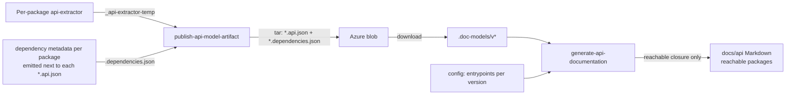

<!-- Copyright (c) Microsoft Corporation and contributors. All rights reserved. Licensed under the MIT License. -->

# Design: Scoping generated API documentation to reachable packages

## Status

Proposal — for review.

## Summary

Today the website publishes API documentation for **every** non-private package in the repo, regardless of
whether that package is actually reachable from our public-facing API surface. This proposal narrows the set of
generated API docs (per site version) down to only the packages that are **reachable via local production
dependencies** from the small, curated set of packages we surface in the website's API navigation.

The key enabler is **per-package dependency metadata** — a small `<package-name>.dependencies.json` file (just
`name` + `dependencies`, trimmed from each package's `package.json`) published alongside that package's API model
(`*.api.json`) in the artifact. This lets the website reconstruct the _version-accurate_ local dependency graph
instead of relying on the current state of the repo (which does not represent historical/branched versions).

## Goals

- Generate API docs only for packages reachable from the nav's entrypoint packages, computed over **local
  (workspace) production dependencies** — `dependencies` and `peerDependencies`, but not `devDependencies`.
- Compute reachability using information that is **accurate for the version being built**, not the current `main`.
- Keep the change backward compatible with already-published artifacts that predate the new metadata.

## Non-goals

- Changing _which_ packages are surfaced in the nav (the curated entrypoint set) — that remains a manual,
  intentional choice.
- Changing the api-extractor build itself, or which packages emit `*.api.json`.
- Reworking how docs are versioned or deployed.

## Current end-to-end flow

Understanding where to intervene requires the full picture. There are three stages spanning two pipelines and the
website build.

### 1. Per-package API model generation (`Build - client packages`)

- Each non-private package defines a `ci:build:docs` script that runs `api-extractor`, emitting
  `<package>.api.json` into the package's `_api-extractor-temp/doc-models` folder.
  - See any of the ~100 `package.json` files with `"ci:build:docs": "api-extractor run"`.
- [tools/pipelines/templates/build-npm-client-package.yml](tools/pipelines/templates/build-npm-client-package.yml)
  runs `npm run ci:build:docs`, then copies every package's `_api-extractor-temp` output into
  `$(Build.ArtifactStagingDirectory)/_api-extractor-temp` and publishes it as the **`_api-extractor-temp`**
  pipeline artifact.
- The set of packages included here is effectively "every package with a `ci:build:docs` script" — i.e. all
  non-private packages, far more than we surface.

### 2. Combine & publish the API model ([publish-api-model-artifact.yml](tools/pipelines/publish-api-model-artifact.yml))

- Triggered by `Build - client packages` on `release/client/*` branches.
- Downloads the `_api-extractor-temp` artifact for the branch, then **flattens all `**/*.api.json`** into a single
  folder (`CopyFiles@2` with `Contents: '**/*.api.json'`, `flattenFolders: true`).
- Archives the folder to `<sha>.tar.gz` and uploads to the `api-extractor-json` Azure blob container as:
  - `<sha>.tar.gz` (always),
  - `latest.tar.gz` (when the branch is `main`),
  - `latest-v<major>.tar.gz` (when the branch is the latest minor of its major train — decided by
    `flub check latestVersions`).
- Then triggers `deploy-website`.

> **Key gap:** the published tarball contains only `*.api.json` files. There is **no dependency-graph
> information** and no record of which packages were private/excluded. So the website cannot know, from the
> artifact alone, how the packages related to each other at that version.

### 3. Website build (download + generate)

- [website/infra/download-doc-models.mjs](website/infra/download-doc-models.mjs) downloads `latest-v1.tar.gz` and
  `latest-v2.tar.gz` into `.doc-models/v1` and `.doc-models/v2`.
  - The version → artifact mapping and output paths are configured in
    [website/config/docs-versions.mjs](website/config/docs-versions.mjs).
- [website/infra/generate-api-documentation.mjs](website/infra/generate-api-documentation.mjs) →
  [website/infra/api-markdown-documenter/render-api-documentation.mjs](website/infra/api-markdown-documenter/render-api-documentation.mjs)
  loads the **entire** API model (`loadModel`) and transforms it to Markdown.
  - The only package-level filtering today is an `exclude` predicate that drops packages by **scope**
    (`@fluid-example`, `@fluid-experimental`, `@fluid-private`). Everything else is generated.
- The nav only actually surfaces a small curated set. For the current (v2) version this is defined in
  [website/sidebars.ts](website/sidebars.ts):
  - `fluid-framework`, `@fluidframework/azure-client`, `@fluidframework/odsp-client`,
    `@fluidframework/tinylicious-client`, `@fluidframework/devtools`, `@fluidframework/presence`.
  - Older versions use `website/versioned_sidebars/version-<v>-sidebars.json` (e.g. v1 surfaces
    `fluid-framework`, `map`, `sequence`, `fluid-static`, ...).

So we _generate_ docs for the full non-private set, but only _link to_ a handful of packages (plus whatever those
transitively reference). Everything unreachable from the curated set is wasted build time and output.

```mermaid
flowchart LR
  A[Per-package api-extractor<br/>all non-private packages] -->|_api-extractor-temp artifact| B[publish-api-model-artifact<br/>flatten all *.api.json + tar]
  B -->|latest-v*.tar.gz| C[Azure blob<br/>api-extractor-json]
  C -->|download-doc-models| D[.doc-models/v*]
  D -->|generate-api-documentation<br/>exclude by scope only| E[docs/api Markdown<br/>ALL non-private packages]
  E --> F[Docusaurus build]
```



## Core problem statement

We want to compute, per site version:

```
reachable = transitiveClosure(entrypoints, edge = "local production dependency")
```

and generate docs only for `reachable` (intersected with the existing public-consumption filters).

The blocker is **version accuracy**. We can trivially walk the local dependency graph of the packages _as they
currently exist in the repo_, but that does not represent the dependencies that existed for a given published
version (v1, or a v2 release branch that has since diverged from `main`). We therefore need to capture the graph
**at build time, from the branch that produced the artifact**, and publish it with the artifact.

## Proposed design

### Overview

1. During the build that produces each package's API model, also emit a small **dependency metadata file**
   (the package's `name` + `dependencies`) alongside its `*.api.json`.
2. Publish those metadata files alongside the `*.api.json` files (inside the same tarball).
3. Define an explicit, per-version **entrypoint package set** in website config.
4. In the website's API doc generation, load the dependency metadata files, compute the reachable closure from
   the entrypoints, and restrict doc generation to that closure.
5. Fall back to today's behavior when the metadata is absent (older artifacts).



### 1. Per-package dependency metadata

Rather than a single central manifest, emit a small **dependency metadata file** — the package's `name` and
`dependencies`, trimmed from its `package.json` — alongside that package's `*.api.json` in the artifact. This
mirrors the existing per-package model (each package already emits its own `*.api.json`) and is automatically
version-accurate, since each file is captured from the exact commit that built the package.

Each file contains only what's needed to walk the graph:

```jsonc
{
  "name": "fluid-framework",
  "dependencies": {
    "@fluidframework/aqueduct": "workspace:~",
    "@fluidframework/map": "workspace:~",
    "fluid-external-thing": "^1.2.3"
  },
  "peerDependencies": {
    "@fluidframework/core-interfaces": "workspace:~"
  }
}
```

Notes:

- **No pre-classification of "local" vs external is needed.** The consumer determines local-ness by _presence_:
  when walking `dependencies`, follow an edge only if a corresponding metadata file exists in the artifact.
  External npm deps (and excluded packages) simply have no file, so traversal stops there naturally.
- **Both `dependencies` and `peerDependencies`** are copied — `devDependencies` are dropped, per the requirement.
  (`peerDependencies` are included because some public surfaces are re-exported through peers.)
- **Name + deps only** — no `private`/release-tag fields. We don't (and shouldn't) generate these files for
  private packages in the first place, so the metadata needs to carry nothing beyond what's required to walk the
  graph.
- These files must not collide when the publish pipeline flattens everything into one folder — see below.

### 2. Generating the model and metadata

Both the API model (`*.api.json`) and its sibling dependency metadata (`*.dependencies.json`) are produced by a
single build-tools command, [`flub generate apiModel`](build-tools/packages/build-cli/src/commands/generate/apiModel.ts).
For each package that produces an API model, the command invokes API Extractor through its programmatic API to
emit the `*.api.json`, then writes the `*.dependencies.json` next to it from the `package.json` already on disk at
that commit. This keeps the metadata coupled to the built commit with no extra checkout and no central aggregation,
and replaces the previous two-pass approach (a separate `api-extractor run` followed by a standalone metadata step).

**File-name collision under flatten.** [publish-api-model-artifact.yml](tools/pipelines/publish-api-model-artifact.yml)
flattens all matched files into a single folder (`CopyFiles@2` with `flattenFolders: true`). `*.api.json` names
are unique per package, but raw `package.json` files would all collide. So each metadata file is emitted under a
package-qualified name that mirrors its `*.api.json` sibling — e.g. `<name>.api.json` →
`<name>.dependencies.json` — and the pipeline's copy glob, which previously matched only `**/*.api.json`, is
broadened to include `**/*.dependencies.json`.

No workspace-graph computation is required at build time — the graph is reconstructed by the consumer from the
collected files.

### 3. Entrypoint package set (website config)

Add an explicit `entrypointPackages` list per version to
[website/config/docs-versions.mjs](website/config/docs-versions.mjs), e.g.:

```js
currentVersion: {
  version: "2",
  // ...
  apiDocs: { /* ... */ },
  entrypointPackages: [
    "fluid-framework",
    "@fluidframework/azure-client",
    "@fluidframework/odsp-client",
    "@fluidframework/tinylicious-client",
    "@fluidframework/devtools",
    "@fluidframework/presence",
  ],
},
```

Rationale for an explicit list (rather than deriving from the sidebar):

- The sidebar identifies packages by output directory name (`api/azure-client`) and display label, not by exact
  npm package name — deriving the graph roots from it is fragile.
- Versioned sidebars are JSON and may drift; a single typed config is the clearer source of truth.

To keep the two in sync:

- **Validation:** add a build-time assertion (or lint/test) that every package surfaced in the sidebar is present
  in `entrypointPackages`, and that every entrypoint ends up in the generated (reachable) set.
- **Documentation:** add a comment on each of the two configs noting that it must be kept in sync with the other.
  The `entrypointPackages` config ([website/config/docs-versions.mjs](website/config/docs-versions.mjs)) should
  point at the sidebar's API Documentation section, and the sidebar configs
  ([website/sidebars.ts](website/sidebars.ts) and each
  `website/versioned_sidebars/version-<v>-sidebars.json`) should point back at `entrypointPackages` \u2014 each
  referencing the validation as the enforcement mechanism.

### 4. Restricting generation to the reachable closure (website)

In [render-api-documentation.mjs](website/infra/api-markdown-documenter/render-api-documentation.mjs) (or a small
pre-computation step in [generate-api-documentation.mjs](website/infra/generate-api-documentation.mjs)):

1. Load every `*.dependencies.json` in the version's `inputPath` (`.doc-models/v<major>`) into a map
   `name -> { dependencies, peerDependencies }`.
2. Compute `reachable` = BFS/DFS closure over `dependencies` + `peerDependencies`, seeded with the version's
   `entrypointPackages`, following an edge only when the dependency has its own entry in the map.
3. Extend the existing `exclude` predicate so a package is generated **only if** it is in `reachable`. Keep the
   current scope-based exclusions as a defense-in-depth safety net.

Pseudocode for the closure:

```js
function computeReachable(packageMetadata, entrypoints) {
  // packageMetadata: Map<name, { dependencies?: Record<string, string>, peerDependencies?: Record<string, string> }>
  const reachable = new Set();
  const queue = [...entrypoints];
  while (queue.length > 0) {
    const name = queue.pop();
    if (reachable.has(name)) continue;
    const meta = packageMetadata.get(name);
    // Absent => external dep (or not in this artifact). Stop; don't generate docs for it.
    // (An *entrypoint* that is absent indicates misconfiguration and should warn.)
    if (meta === undefined) continue;
    reachable.add(name);
    for (const dep of Object.keys({ ...meta.dependencies, ...meta.peerDependencies })) queue.push(dep);
  }
  return reachable;
}
```

Then, in the transformation config:

```js
exclude: (apiItem) => {
  if (isPackage(apiItem)) {
    if (reachable !== undefined && !reachable.has(apiItem.name)) {
      return true; // not reachable from nav entrypoints for this version
    }
    // ...existing scope-based exclusions preserved as a safety net...
  }
  return false;
},
```

### 5. Backward compatibility / fallback

Already-published artifacts (notably `latest-v1.tar.gz`) do **not** contain the `*.dependencies.json` files, and
will not until the corresponding release branch republishes. The website must handle this gracefully:

- If **no** `*.dependencies.json` files are present, `reachable` is `undefined` and generation falls back to
  today's behavior (include all non-private packages, scope-exclusions only).
- If present, apply the reachable-closure filter.

This makes the change safe to land incrementally: it takes effect for a version only once that version's artifact
has been re-published with the metadata.

## Alternatives considered

- **Walk the current-repo dependency graph.** Rejected: not version-accurate. The current `main` graph does not
  represent v1 or a diverged v2 release branch, which is the whole point of the exercise.
- **Reconstruct reachability from the API model's own cross-package references.** The api-extractor model records
  cross-package symbol references, so we could compute "packages referenced by the public API of the entrypoints."
  This is arguably _more_ precise than package.json dependencies (it excludes deps that contribute no
  public-surface types) and needs no extra metadata. Downsides: it only captures packages whose symbols are
  actually referenced (a dependency contributing only re-exports or ambient types might be missed), and it is more
  complex to compute. Worth prototyping as a follow-up refinement, but the per-package dependency metadata is the
  more predictable, requirement-aligned first step.
- **A single central manifest** (one JSON listing every package and its local deps, generated by a new `flub`
  command). Rejected in favor of the per-package `*.dependencies.json` files: the per-package approach needs no
  build-time graph computation, mirrors the existing per-package `*.api.json` model, is automatically
  version-accurate, and lets the consumer determine local-ness by file presence. The only added cost is a
  file-naming scheme to avoid collisions when the publish pipeline flattens the artifact.
- **Filter at the model-download step** (prune `*.api.json` before generation). Deferred: `*.api.json` files are
  small and `loadModel` is cheap relative to Markdown generation + the Docusaurus build, so filtering at
  transform time captures nearly all the savings with less machinery. Can be revisited if load time matters.

## Impact / expected benefit

- Fewer generated Markdown documents → faster `build:generate-content` and, more importantly, a faster Docusaurus
  build (its build time scales with document count and is the dominant cost).
- Smaller site output and fewer opportunities for broken-link/anchor failures from orphaned, unlinked API docs.
- The generated set becomes an intentional, reviewable function of the curated nav entrypoints.

## Risks & considerations

- **Public API referencing excluded packages.** If an entrypoint's public API references a type from a package
  that is reachable but scope-excluded (e.g. `@fluid-internal`), links could break. This risk exists today; the
  reachable-closure filter does not make it worse, but the interaction between "reachable" and "scope-excluded"
  should be validated (broken-link detection already runs with `onBrokenLinks: "throw"`).
- **Entrypoint/config drift.** Mitigated by the sidebar ↔ `entrypointPackages` validation described above.
- **Metadata correctness across workspaces.** The repo has multiple workspaces (client, server, build-tools,
  etc.). "Local" must be interpreted consistently — here, by the presence of a `*.dependencies.json` file for the
  dependency in the same artifact — across whichever workspace(s) contribute packages to the published artifact.
- **Rollout lag.** Filtering only applies once a version's artifact is republished with the metadata (acceptable
  and intentional; see fallback).

## Resolved decisions

1. **Entrypoint set location:** the `entrypointPackages` set lives in
   [website/config/docs-versions.mjs](website/config/docs-versions.mjs), alongside the other version-related
   config, rather than being derived from the sidebars. Drift is handled by the validation + cross-referencing
   comments described in Section 3.
2. **Downloaded model pruning:** out of scope for now. We filter at generation time only; we won't prune the
   downloaded `*.api.json` input. Can be revisited if model load time ever becomes a concern.
3. **No extra fields in `*.dependencies.json`:** the files carry only `name` + deps. We don't (and shouldn't)
   generate these files for private packages, so there's no need to record `private`/release-tag metadata for the
   website to reason about.

## Rough implementation plan

1. Emit a `<name>.dependencies.json` (name + `dependencies` + `peerDependencies`) next to each `*.api.json` —
   e.g. via a small `copyfiles`/script or `flub` helper in the package's `ci:build:docs` output.
2. Broaden the copy glob in
   [build-npm-client-package.yml](tools/pipelines/templates/build-npm-client-package.yml) /
   [publish-api-model-artifact.yml](tools/pipelines/publish-api-model-artifact.yml) so the `*.dependencies.json`
   files travel into the tarball alongside `**/*.api.json`.
3. Add `entrypointPackages` per version in
   [website/config/docs-versions.mjs](website/config/docs-versions.mjs) + a drift-check.
4. Compute the reachable closure and extend the `exclude` predicate in
   [render-api-documentation.mjs](website/infra/api-markdown-documenter/render-api-documentation.mjs), with the
   no-metadata fallback.
5. Validate end-to-end locally via `LOCAL_API_DOCS=true` (which can emit the `*.dependencies.json` files from the
   current repo), then in CI once a release branch republishes.
